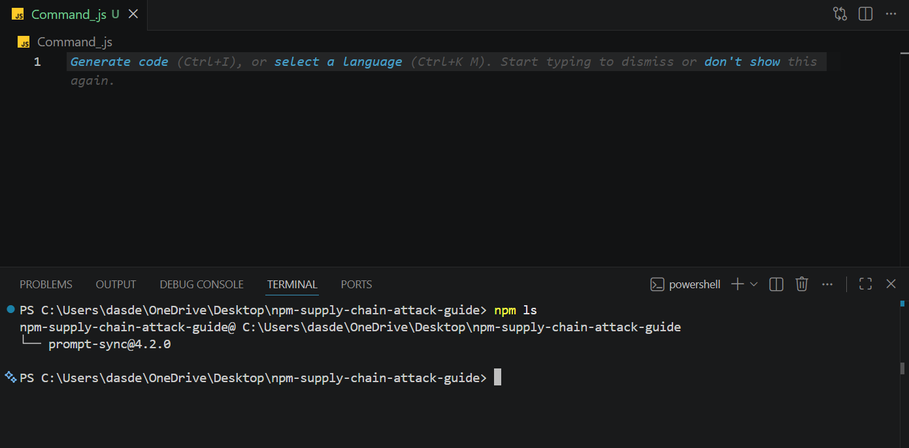
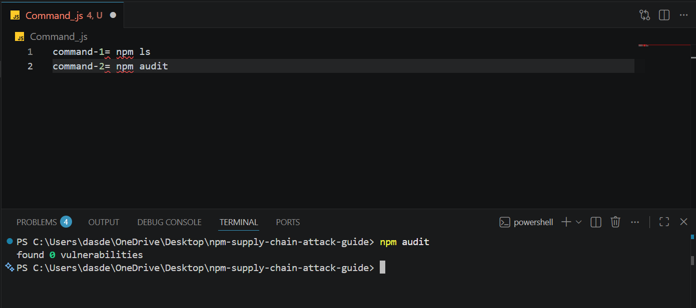
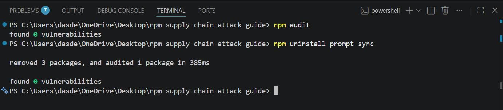

# 🚨 npm Supply Chain Attack Guide

Understanding the June 2026 Red Hat npm Package Compromise and how developers can respond.


---

## 📖 Overview

Modern software development relies heavily on third-party packages. While package managers such as npm make development faster and easier, they also introduce security risks.

This repository explains the Red Hat npm package compromise discovered in June 2026, how software supply chain attacks work, and the steps developers should take to protect themselves.

### Goals

* Understand what happened
* Learn how supply chain attacks work
* Know what to do after running `npm install`
* Improve development security practices

---

## 🚨 What Happened?

In June 2026, security researchers discovered that multiple npm packages associated with Red Hat's cloud services ecosystem had been compromised.

The attack was a software supply chain attack, where malicious code was introduced into packages that developers trusted.

The dangerous aspect of this attack was that developers did not necessarily need to execute suspicious code manually. Installation scripts could potentially run automatically during package installation.

This incident highlights an important cybersecurity lesson:

> Trusting a package does not mean trusting every version of that package.

---

## 🔍 How Do npm Supply Chain Attacks Work?

A simplified attack flow:

1. Attacker gains access to a package or publishing process.
2. Malicious code is injected into a package.
3. Developers install or update the package.
4. Installation scripts execute.
5. Sensitive data or credentials may be exposed.

Common targets include:

* API Keys
* GitHub Tokens
* Cloud Credentials
* Database Passwords
* Environment Variables

---

# 🛠 What Should I Do If I Already Ran npm install?

## Step 1: Check Installed Dependencies

```bash
npm ls
```

Review installed packages and identify any suspicious dependencies.

---

## Step 2: Audit Dependencies

```bash
npm audit
```

Check for known vulnerabilities and security issues.

---

## Step 3: Inspect package.json

Review installation scripts:

```json
{
  "scripts": {
    "preinstall": "...",
    "install": "...",
    "postinstall": "..."
  }
}
```

Look for:

* Obfuscated code
* Suspicious URLs
* Unexpected PowerShell commands
* Shell execution commands

---

## Step 4: Remove Suspicious Packages

```bash
npm uninstall package-name
```

Remove any packages that are known to be compromised or untrusted.

---

## Step 5: Rotate Credentials

Immediately rotate:

* GitHub Tokens
* API Keys
* Cloud Credentials
* Database Passwords
* Access Tokens

This reduces potential damage if credentials were exposed.

---

## Step 6: Run a Security Scan

Perform a full system scan using:

* Microsoft Defender
* Malwarebytes
* Other trusted security tools

Verify that no malicious processes remain active.

---

## Step 7: Monitor Accounts

Check for:

* Unauthorized logins
* Unexpected API usage
* Strange GitHub activity
* Unusual cloud resource consumption

---

# 🔐 Prevention Best Practices

## Use npm audit Regularly

```bash
npm audit
```

Regular audits help identify vulnerabilities early.

---

## Inspect package.json Before Installation

Always review installation scripts when working with unfamiliar projects.

---

## Verify Package Maintainers

Before installing a package:

* Check the maintainer
* Check repository activity
* Review community trust

---

## Keep Dependencies Updated

Regular updates help ensure security patches are applied.

```bash
npm update
```

---

## Use Least Privilege

Avoid exposing:

* Production credentials
* Administrative tokens
* Sensitive environment variables

during development.

---

# ✅ Incident Response Checklist

* [ ] Check installed packages
* [ ] Run npm audit
* [ ] Review package.json scripts
* [ ] Remove suspicious dependencies
* [ ] Rotate credentials
* [ ] Run a security scan
* [ ] Monitor accounts for unusual activity
* [ ] Document findings

---

# 📚 Key Takeaway

Software supply chain attacks are becoming increasingly common.

As developers, securing our development environment is just as important as writing secure code.

**Security is no longer optional. It is a core developer skill.**

---

## ⭐ Support

If this repository helped you learn something new, consider giving it a star.

Built for learning, awareness, and developer security.

<br>

<br>

<br>

